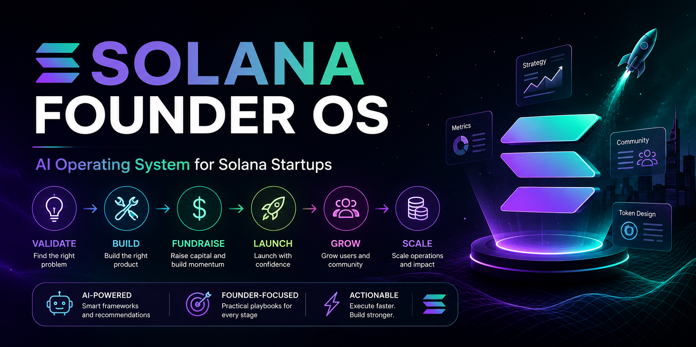
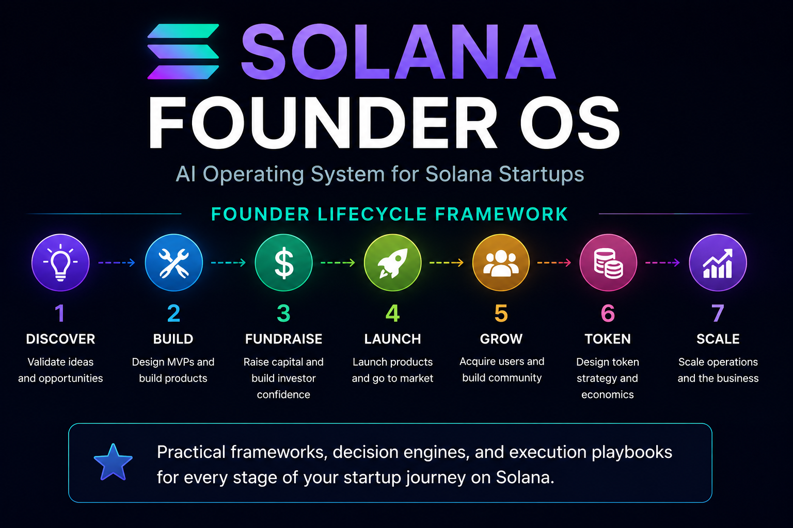
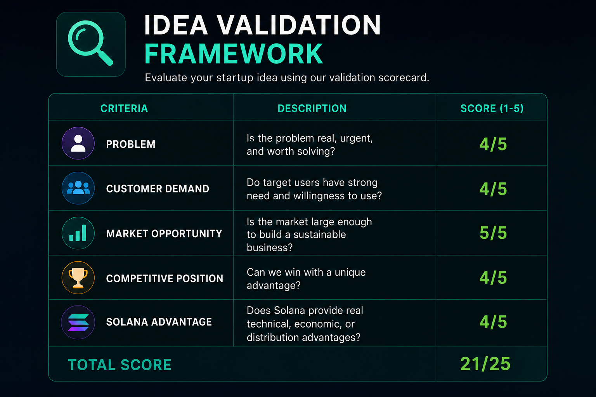
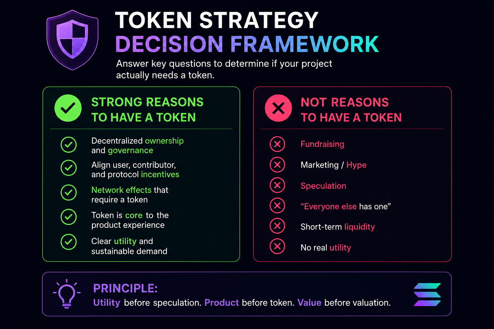
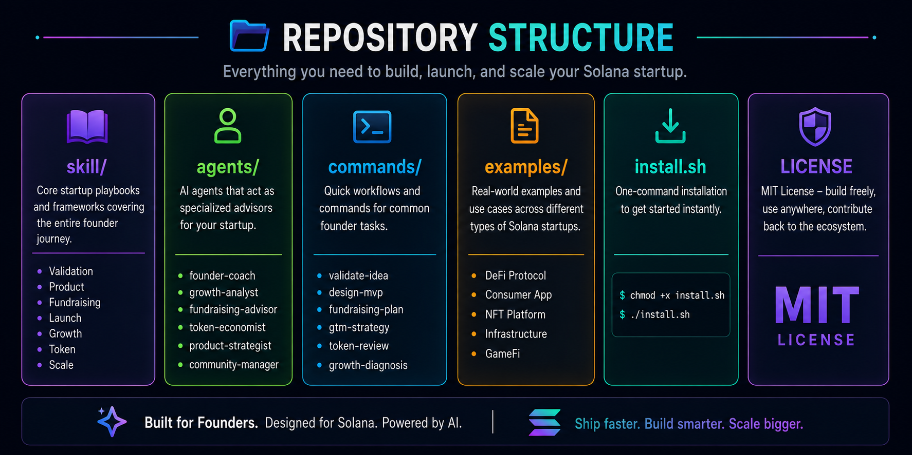

# Solana Founder OS

> AI operating system for building, launching, and scaling startups in the Solana ecosystem.

Solana Founder OS is a production-ready AI skill designed for founders, operators, and startup teams building on Solana.

While most Solana AI skills focus on development, security, or infrastructure, Founder OS focuses on the challenges every startup faces after the code is written:

* Validating ideas
* Finding product-market fit
* Building an MVP
* Raising capital
* Launching products
* Growing communities
* Designing token strategies
* Scaling operations

Founder OS provides structured playbooks, decision frameworks, and execution workflows covering the entire startup lifecycle.

---

## Why Founder OS?

Most Solana AI skills focus on writing code.

Most startup failures are not caused by code.

They are caused by:

* Building products nobody wants
* Poor distribution
* Weak positioning
* Premature token launches
* Lack of user retention
* Operational mistakes

Founder OS was built to help founders make better decisions throughout the entire startup lifecycle.

From idea validation and MVP design to fundraising, launch strategy, token planning, and scaling, Founder OS provides practical frameworks and execution playbooks designed specifically for Solana startups.


## What Makes This Different?

Most startup advice is generic.

Most crypto advice is focused on speculation.

Founder OS combines startup best practices with lessons learned from crypto-native products, token launches, ecosystem growth, community building, and founder execution.

The goal is not to generate ideas.

The goal is to help founders make better decisions.

From validating an idea to deciding whether a token should exist, Founder OS acts as a structured decision-making framework for Solana startups.


## Why This Skill Exists

Building a product is only one part of building a successful startup.

Many founders struggle with questions such as:

* Is my idea worth pursuing?
* Who is my ideal customer?
* What should I build first?
* When should I raise capital?
* Do I actually need a token?
* How should I launch?
* How do I acquire users?
* What metrics matter?

Founder OS helps answer those questions through practical founder-focused workflows rather than generic advice.

---

## Startup Lifecycle Coverage



Founder OS guides teams through every stage of the startup journey.

```text
Idea
 ↓
Validation
 ↓
Market Research
 ↓
Customer Discovery
 ↓
MVP Design
 ↓
Fundraising
 ↓
Launch
 ↓
Growth
 ↓
Token Strategy
 ↓
Scale
```

---

## Modules

### Founder Playbooks

High-level operating system for founders.

* Startup stage assessment
* Founder checklists
* Execution roadmaps
* Common mistakes
* Decision frameworks

### Validation



#### idea-validation.md

* Idea evaluation
* Validation frameworks
* Product-market fit hypotheses
* Risk assessment

#### market-research.md

* TAM analysis
* Competitive landscape
* Market positioning
* Opportunity mapping

#### customer-discovery.md

* ICP development
* User interview frameworks
* Customer feedback systems

---

### Build

#### product-strategy.md

* Product vision
* Feature prioritization
* Product roadmaps
* Monetization planning

#### mvp-design.md

* MVP scoping
* Validation-first development
* Resource prioritization

---

### Fundraising

#### fundraising.md

* Fundraising strategy
* Investor targeting
* Pitch deck guidance
* Fundraising readiness

#### investor-relations.md

* Investor updates
* Communication frameworks
* Stakeholder management

---

### Launch

#### launch-strategy.md

* Beta launches
* Mainnet launches
* Product launches
* Launch sequencing

#### go-to-market.md

* User acquisition
* Distribution strategies
* Ecosystem expansion
* Launch campaigns

---

### Growth

#### community-growth.md

* Ambassador programs
* Community activation
* Retention systems
* Contributor funnels

#### content-distribution.md

* Founder content
* Educational content
* Ecosystem awareness
* Content engines

#### partnerships.md

* Ecosystem partnerships
* Strategic collaborations
* Integration opportunities
* Co-marketing initiatives

---

### Token

#### token-strategy.md



* Token necessity analysis
* Utility design
* Incentive alignment
* Economic sustainability

#### token-launches.md

* TGE planning
* Launch sequencing
* Liquidity planning
* Distribution frameworks

#### airdrop-design.md

* Incentive programs
* Reward systems
* User activation
* Sybil resistance concepts

---

### Scale

#### growth-metrics.md

* KPI frameworks
* Growth diagnostics
* Funnel analysis
* Retention metrics

#### operations.md

* Team scaling
* Operational systems
* Startup processes
* Organizational design

---

## Repository Structure



Founder OS includes:

- Startup playbooks
- Specialized AI agents
- Founder workflows
- Real-world startup examples
- Installation scripts
- Founder-focused commands

The repository is organized into modular components that allow founders to load only the context they need, keeping interactions efficient while covering the full startup lifecycle.

---

## Example Prompts


### Idea Validation

* Validate my idea for a Solana consumer application.
* Review my startup idea and identify weaknesses.
* Is this problem worth solving?
* Analyze the market opportunity for this startup.
* Does Solana provide a meaningful advantage here?

### Product Strategy

* Help me prioritize features for my MVP.
* Design an MVP for this startup idea.
* What should I build first?
* Review my product roadmap.
* Identify unnecessary features in my MVP.

### Fundraising

* Evaluate my fundraising readiness.
* Review my fundraising strategy and identify weaknesses.
* How much capital should I raise?
* Help me improve my investor narrative.
* Analyze whether my startup is ready to raise.

### Go-To-Market

* Create a Solana GTM strategy.
* Design a launch plan for my startup.
* Which distribution channels should I prioritize?
* How should I acquire my first 1,000 users?
* Build a launch strategy for my Solana product.

### Community Growth

* Design an ambassador program for my startup.
* Create a community growth strategy.
* How can I improve community retention?
* Build a contributor program.
* Diagnose why community engagement is declining.

### Partnerships

* Identify partnership opportunities for my startup.
* Build a partnership strategy.
* Which ecosystem projects should I integrate with?
* Create a co-marketing plan.

### Token Strategy

* Does my project actually need a token?
* Should my startup launch a token?
* Review my token utility design.
* Audit my token launch plan.
* Analyze whether my incentive model is sustainable.

### Growth Analytics

* Diagnose why user growth has stalled.
* Identify bottlenecks in my growth funnel.
* What metrics should I track?
* Review my startup's KPI framework.
* Analyze retention issues.

### Founder Playbooks

* What stage is my startup currently in?
* What should I focus on next?
* Identify the biggest risk facing my startup.
* Create a founder roadmap for the next 90 days.
* Help me prioritize strategic decisions.

---

## Design Principles

Founder OS follows five principles:

1. Practical execution over theory.
2. Retention over vanity metrics.
3. Distribution before paid acquisition.
4. Sustainable growth over short-term spikes.
5. Actionable frameworks over generic advice.

---

## Intended Users

* Solana Founders
* Startup Operators
* Growth Teams
* Product Managers
* Community Leads
* Accelerator Participants
* Early-Stage Startup Teams

---

## Installation

Clone the repository and copy the skill into your preferred AI skill directory.

The primary entry point is:

skill/SKILL.md

---

## License

MIT
